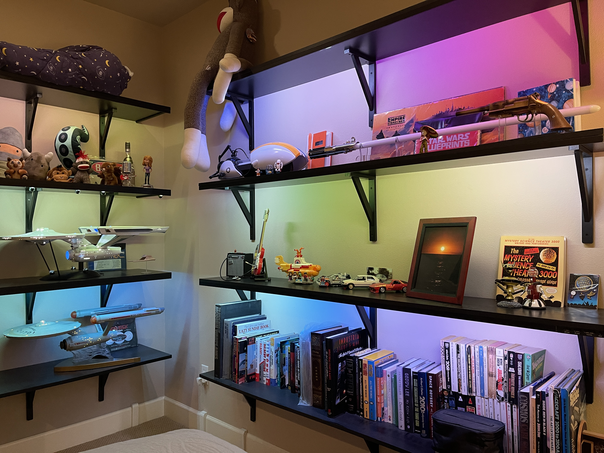

LED Controller
==============================================================================
&copy; 2026 by Tony Fabris

https://github.com/tfabris/LED-Controller

Arduino code and construction information for a set of colored LED strands attached to display shelves in my master bedroom. The LED strands are programmed to illuminate in various color patterns, both solid and color-cycling. 

|  |
|:-----------------------:|

|                    |   |
|:-----------------------------------------------:|:------------------------------:|
|  |  |

This code is written to use the FastLED library, using WS2812 LED strips, also known as Neopixels. It is intended to run on an Arduino Mega processor board. 

This repository stores the reference materials, schematics, measurements, source code, and links that I used for the shelving and lighting project. Also included are the 3D modeling files for the control box enclosure and the baseboard wiring cover.

Project Links
-------------

[README.md](            README.md)                      &nbsp;&nbsp;&nbsp;&nbsp;&nbsp;← *You Are Here*  
`    ├──`[3D Prints](   3D%20Prints)              &nbsp;&nbsp;&nbsp;&nbsp;&nbsp;&nbsp;Blender files  
`    ├──`[Reference](   Reference)                      &nbsp;&nbsp;&nbsp;&nbsp;&nbsp;Info, measurements  
`    └──`[Schematics](  Schematics)                                       &nbsp;&nbsp;Wiring drawings  
[LED_Controller.ino](   LED_Controller.ino) &nbsp;&nbsp;&nbsp;&nbsp;&nbsp;&nbsp;&nbsp;Main functions  
[Patterns.h](           Patterns.h)         &emsp;&emsp;&emsp;&emsp;&emsp;&nbsp;&nbsp;Color patterns  
[FastLED_RGBW_2.h](     FastLED_RGBW_2.h)                     &nbsp;&nbsp;&nbsp;&nbsp;RGBW Workaround  

Software Notes
--------------

### Libraries

The code uses these Arduino libraries, which can be installed from the Arduino IDE: Select the Sketch menu, select Include Library, then select Manage Libraries.
- ArduinoUniqueID.h [(info)](https://github.com/ricaun/ArduinoUniqueID)
- FastLED.h:        [(info)](https://fastled.io/)
- Button2.h:        [(info)](https://github.com/LennartHennigs/Button2)

### RGBW Limitation

The lighting strands that I'm using are a special "RGBW" type, with four LEDs per pixel instead of three. Instead of just the traditional Red, Green and Blue (RGB) LEDs in each pixel, it also adds a fourth White (W) LED to each pixel. 

These RGBW strands are very versatile, adding more color options and extra brilliance. But the FastLED code library (at the time I built this) didn't have full support for RGBW strands yet. The library doesn't have any RGBW commands available for the particular Arduino chip I'm using in the controller. This is solved by the file [FastLED_RGBW_2.h](FastLED_RGBW_2.h), which contains additional functions and features for supporting the extra LEDs.

### Patterns

There are several different color patterns programmed into the file [Patterns.h](Patterns.h), which are selectable from the control box. This set of patterns is hard-coded, but can be changed by editing the code in Patterns.h if needed.

To see the name and sequence number of each pattern as they are being selected, connect a computer to the controller board with a USB cable, then use the Serial Monitor to view the text coming from the serial port while pressing the selection buttons.

### Spotlights

I've programmed the system to have spotlights that I can toggle on and off. These spotlights are a just few specific LEDs in the strand which can be toggled to shine bright white all the time. The purpose is to provide illumination for certain collectibles displayed on the shelves. Some of the spotlights just shine white, directly from the LED strand, to softly illuminate the desired objects, while a few of the spotlights are focused, directed through lenses and gobos to make specific [spotlight shapes for my Enterprise Refit replica](https://github.com/tfabris/EnterpriseSpotlights).

Controls
--------

I have designed the LED lighting system to be controlled by a set of eight physical pushbuttons, soldered to a perfboard which is soldered to the the Arduino, then mounted in a [3D-printed control box](Photos/Control%20Box.jpg), attached directly to one of the shelves. One of the LED rails is slightly shorter to make room for the box on the end of that shelf. I didn't add any sort of app, WiFi, or remote control (yet). This was my deliberate choice, because I wanted the system to be simple and reliable. I may add WiFi later.

In addition to responding to the buttons on the control box, I added some serial commands as well. These serial commands can be used in the Arduino Serial Monitor when a computer is connected to the controller box with a USB cable (such as when modifying or debugging the code).

| Button                      | Function              | Serial command |
|-----------------------------|-----------------------|----------------|
| Sleep                       | Standby on/off        | o              |
| Sleep (hold)                | Reset controller      | r              |
| Color up or down            | Select color pattern  | n, p           |
| Color up or down (hold)     | Spotlights on/off     | s              |
| Color up+down (press both)  | Toggle color cycling  | t              |
| Favorites (tap)             | Select favorite       | a, b, c        |
| Favorites (hold)            | Save favorite         | A, B, C        |
| Bright up or down           | Brightness +/-        | +, -           |

Materials
---------

### Supplies

  - Arduino Mega 2560 control module:
    - https://www.amazon.com/dp/B07TGF9VMQ
  - Environmental Lights CS110-2m-B 45° LED strip channel rails, black anodized, end caps sold separately:
    - https://www.environmentallights.com/19358-cs110-2m-b.html
    - https://www.environmentallights.com/19364-el-cap-155-b.html
  - BTF-Lighting RGBW SK6812 LED strip, 60 Pixels/m:
    - https://www.amazon.com/dp/B079ZW1265
  - 3-conductor wire and connectors:
    - https://www.amazon.com/dp/B0BG3Y9Y8P
  - Light strip connectors, smaller (because the ones in the kit above are too big to fit in the rails):
    - https://www.amazon.com/gp/product/B0B3DG5L55    
  - Mean Well LRS-200-5 200W 5V 40-amp power supply to drive several meters worth of LED strips:
    - https://www.amazon.com/dp/B0131V99BA
    - ***Note:*** Don't try to drive more than a handful of LEDs "directly" off of an Arduino, without a separate power supply. For LED strips of any length, a proper power supply is required, to prevent frying the Arduino board.
  - Additional accessories for the Mean Well power supply:
    - https://www.avoutlet.com/power-products/terminal-blocks/mean-well-mhs012-panel-mount-feet/
    - https://www.digikey.com/en/products/detail/mean-well-usa-inc/TBC-09/7707110
  - Black cable channels 2 x 39 inches each (qty:3):
    - https://www.amazon.com/dp/B09CKV1YGH
  - Blue Sea System ST Blade Fuse Block, 6 Circuit:
    - https://www.amazon.com/dp/B006VELERM
  - Perfboard:
    - https://www.amazon.com/dp/B081QYPHHP
  - Resistor for data line, 330 ohm:
    - https://www.digikey.com/en/products/detail/stackpole-electronics-inc/CF14JT330R/1741399
  - 90 degree switches with long black actuators: (8):
    - https://www.digikey.com/en/products/detail/cit-relay-and-switch/CT1102V13-35F100/16607670
  - GE Grounded Outlet Switch:
    - https://www.lowes.com/pd/GE-Grounded-Outlet-Switch-15-Amp-120-250-Volt-NEMA-6-50p-3-wire-General-duty-Plug-White/5000251403
  - Rubbermaid melamine shelf 71.8"x11.8"x0.63" (qty 4):
    - https://www.homedepot.com/p/Rubbermaid-Black-Laminated-Wood-Shelf-12-in-D-x-72-in-L-FG4B8200BLA/202260835
  - Melamine shelf 16"x36"x3/4" (qty 4):
    - https://us.amazon.com/White-Laminate-Shelf-Melamine-Accurate/dp/B07H43G8QP?th=1
  - StyleWell wooden shelf brackets 11.5"x7.5" (qty 20):
    - https://www.homedepot.com/p/StyleWell-11-5-in-x-7-5-in-Black-Wooden-Decorative-Shelf-Bracket-27794PKLHD/312264280
    - The shelf brackets come with screws already. Ensure that the shelf bracket screws go into actual wall studs, not just the drywall.
  - Links for more detailed supplies may be found here:
    - [Reference/Measurements and sourcing.txt](Reference/Measurements%20and%20sourcing.txt)

### Software

  - The source files for this project:
    - https://github.com/tfabris/LED-Controller/archive/refs/heads/master.zip
  - Arduino IDE:
    - https://www.arduino.cc/en/software/
  - Blender - for editing and exporting the 3D printed enclosure box and baseboard covers:
    - https://www.blender.org/

### Reference

  - LED lighting primer information:
    - https://www.youtube.com/watch?v=UhYu0k2woRM
  - Choosing a power supply:
    - https://www.superbrightleds.com/blog/choose-right-power-supply-led-strip-lighting.html
  - Make sure to understand the Live versus Neutral versus Ground pins for the main AC into the power supply (section 8 of the installation manual):
    - https://www.meanwell.com/Upload/PDF/Enclosed_Type_EN.pdf
  - Why fuses are needed:
    - https://quinled.info/2019/02/18/use-fuses-for-increased-safety/

Construction Notes
------------------

### Hidden Wiring

The wiring all pops in and out of the wall at various points, as needed. I made the holes in the wall as small as possible and touched up the edges of the holes carefully, using the original wall color paint. To run the wires through the walls, I used a combination of fish tape, string, and a magnetic wire puller:
  - https://www.amazon.com/dp/B081TVR4N7/
  - https://www.amazon.com/dp/B0DT5CFJQ4/

I'm using some [3D printed baseboard covers](Photos/Plug%20and%20Baseboard%20Covers.jpg) to cover the places where I run wires out of the walls and over the baseboards near the floor and run along under the edge of the carpet. I did this because I didn't want to rip out the baseboards to hide the wiring under them, and didn't want to damage the wall by trying to drill sideways through studs.

Where each wiring bundle comes out of the wall at a shelf, I've made sure to place the holes so that the wires sneak just underneath the bottom face of the corresponding shelf, so that the wires pop directly into the [black cable channels on the underside of the shelves](Photos/LED%20Channel.jpg) to hide the wires. From there, the wires run to the 45° LED channel rails at each end of each shelf.

Where possible, the wiring follows a zigzag pattern along the shelves and through the walls, instead of doubling back on itself. For example, it comes out of the wall at one end of the shelf, connects to the LED strip, then comes from the other end of the LED strip, runs back into the wall at that other end, then inside the wall up to the next shelf, out the wall to the next LED strip, and so on. This saves wiring run distance so that there's less power loss along the wires for powering the LEDs. But it also means that the LEDs, when addressed sequentially, run leftward on one shelf and then rightward on the next shelf, and so on. This is illustrated by the green lines in the [wiring diagram](Schematics/Wiring%20Diagram.pdf).

In addition to the LED power and control wires, there are extra "power feed" wires coming from the Mean Well power supply (through the fuse block) to various points in the LED wiring run. This is necessary to boost power at certain points, to help counteract the power loss that occurs along the LED run. These are illustrated by the red lines in the [wiring diagram](Schematics/Wiring%20Diagram.pdf).

### A/C Power

The main power comes from a nearby wall outlet, where I have plugged in a small GE switched outlet adapter, in case I need to kill the power. In practice, this kill switch stays on all the time, and I control the lights with the control box. The right-angle power cord (cannibalized from a power strip with a right-angle plug) runs down, over the baseboard, through one of the [aforementioned 3D-printed baseboard covers](Photos/Plug%20and%20Baseboard%20Covers.jpg), along the edge of the carpet, and back up to the Mean Well power supply mounted beneath the lowest shelf.

### Shelves

The shelf bracket screws go into actual wall studs. I found the stud locations by initially testing with a stud finder tool, then finding all of the the stud nails with magnets. The shelves were measured out to equal distances and heights, and leveled using a laser level.

The [45° LED channel rails](Photos/LED%20Channel.jpg) are carefully CA-glued to the underside edges of the shelves (glued into place *before* mounting the shelves on the wall). This is a very tricky job to get right, since the CA dries fast and I had to put the rails precisely in their final position on the very first drop. It was a two-person job.

To Do:
------

- Re-do the controller module to use an ESP32 instead of an Arduino. It would be a complete rewrite and require entirely different code libraries, but would have greater flexibility. In addition to having more CPU horsepower for the lighting code, It would allow updating its firmware via WiFi and control the lights via WiFi.
- Add A/C power taps and/or USB-C power at the shelves, so that I can charge or power other devices which need it.

